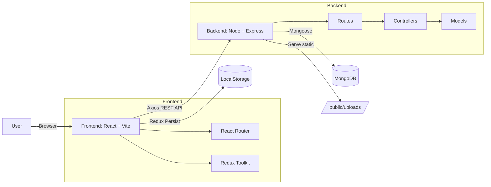

<div align="center">

# 🏡 Just Home  
### A modern full‑stack property listing platform (MERN-style) — fast, responsive, and user-friendly.

<!-- Badges -->


<br/>

<!-- Quick Nav -->
<a href="#-project-overview">Overview</a> •
<a href="#-project-links">Project Links</a> •
<a href="#-architecture-flow">Architecture</a> •
<a href="#-tech-stack">Tech Stack</a> •
<a href="#-features">Features</a> •
<a href="#-setup-guide">Setup</a> •
<a href="#-usagecommands">Commands</a> •
<a href="#-troubleshooting">Troubleshooting</a> •
<a href="#-contributing">Contributing</a>

</div>

---

## 🚀 Project Overview

> **Project Name:** Just Home  
> **Description:** A full‑stack web app for browsing, listing, filtering, and managing properties with authentication, image uploads, and wishlist support.  
> **Technologies:** React (Vite), Redux Toolkit, Node.js, Express, MongoDB (Mongoose), JWT, Multer, MUI  
> **Purpose:** Helps users discover properties quickly with rich filtering, view property details, and manage favorites—while allowing authenticated users to create/manage listings.

<div align="center">

> [!NOTE]
> **This repository contains two apps:** `Backend/` (API) and `Frontend/vite-project/` (Web UI).

</div>

---

## 🔗 Project Links

<table>
<tr>
<td align="center" width="25%">

### 🌐 **Frontend**
[](#)

[View Live Site →](https://just-home-one.vercel.app/)

</td>
<td align="center" width="25%">

### ⚙️ **Backend**
[](#)

[API Server →](https://just-home.onrender.com)

</td>
<td align="center" width="25%">

### 📖 **API Docs**
[](#)

[Documentation →](https://documenter.getpostman.com/view/39216893/2sBXinGAS4)

</td>
<td align="center" width="25%">

### ▶️ **Demo Video**
[](#)

[Watch on YouTube →](https://youtu.be/qXq7HnzYWCc?si=ZZbgPhJDOrtiFf6Z)

</td>
</tr>
</table>

---

## 🎯 Problem vs Solution

<div align="center">

| Problem (❌) | Solution (✅) |
|---|---|
| Hard to find listings that match exact needs | Powerful filters: city/state/type/price/features/bedrooms |
| No easy way to save favorites | Wishlist support linked to user accounts |
| Uploading property images is complex | Simple multi-image upload flow (Multer) |
| Users struggle with sign-in and identity | JWT-based authentication + persisted session |
| No structured backend for property CRUD | RESTful API with controllers, routes, and models |

</div>

---

## 📂 Architecture Flow



---

## 🧰 Tech Stack

<div align="center">

| Layer | Tech |
|---|---|
| Frontend | React 18, Vite, React Router |
| UI | MUI, Emotion |
| State | Redux Toolkit, redux-persist |
| Backend | Node.js, Express |
| Database | MongoDB Atlas, Mongoose |
| Auth | JWT, bcryptjs |
| Uploads | Multer (disk storage) |
| HTTP | Axios |
| Tooling | ESLint |

</div>

---

## 📊 Features

<div align="center">

| Feature | Status |
|---|---|
| User Registration / Login (JWT) | ✅ |
| Profile Update + Profile Image Upload | ✅ |
| Property Create / Read / Update / Delete | ✅ |
| Upload multiple property images | ✅ |
| Filter listings (search/category/type/price/features/bedrooms) | ✅ |
| Wishlist (add/remove/view) | ✅ |
| Protected routes for authenticated actions | ✅ |
| Persisted auth state (redux-persist) | ✅ |

</div>

---

## 🔐 API Overview (High Level)

> [!TIP]
> Main backend route groups:
> - `/users` → auth, profile, wishlist  
> - `/properties` → CRUD + search/filter endpoints  
> - `/contactus` → contact form handling  
> - `/stayuptothedate` → newsletter/updates

Example property endpoints:
```bash
GET     /properties
GET     /properties/:id
GET     /properties/filter?search=&category=&minPrice=&maxPrice=&status=&features=
POST    /properties           # multipart/form-data (photos)
PUT     /properties/:id       # multipart/form-data (photos)
DELETE  /properties/:id
```

---

## 🚀 Setup Guide

### 1) Prerequisites
- Node.js **18+** recommended
- MongoDB Atlas URI (or local MongoDB)

### 2) Clone the repository
```bash
git clone https://github.com/homasvikaneria/just_home.git
cd just_home
```

### 3) Backend setup
```bash
cd Backend
npm install
```

Create `.env` file in `Backend/`:
```bash
PORT=3000
MONGO_URI=your_mongodb_connection_string
JWT_SECRET=your_super_secret_key
```

Start backend:
```bash
npm start
```

### 4) Frontend setup
```bash
cd ../Frontend/vite-project
npm install
npm run dev
```

---

## 👨‍💻 Usage/Commands

### Backend
```bash
cd Backend
npm start
```

### Frontend
```bash
cd Frontend/vite-project
npm run dev
npm run build
npm run preview
```

### Example: Test API quickly (curl)
```bash
curl -X GET http://localhost:3000/properties
```

---

## 🐛 Troubleshooting

<details>
<summary><b>Backend fails to start: MONGO_URI is missing</b></summary>

**Cause:** `Backend/index.js` exits when `MONGO_URI` is not present.  
✅ Fix:
1. Ensure `Backend/.env` exists  
2. Add:
```bash
MONGO_URI=your_mongodb_connection_string
```
3. Restart:
```bash
npm start
```
</details>

<details>
<summary><b>Images are not showing (404 on /uploads/...)</b></summary>

✅ Checks:
- Confirm backend is running and serving static uploads:
- Ensure folder exists:
```bash
Backend/public/uploads
```
- Confirm your saved `photos[]` paths look like:
```javascript
"/uploads/your-image.jpg"
```
</details>

<details>
<summary><b>CORS errors in browser</b></summary>

✅ Fix options:
- Make sure backend has `cors()` enabled (it does).
- Ensure frontend calls the correct API base URL.
- If deploying, allow your deployed frontend domain in CORS config.

Example (allow specific origin):
```javascript
app.use(cors({ origin: "https://your-frontend-domain.com" }));
```
</details>

<details>
<summary><b>Login works but protected routes still redirect to /login</b></summary>

✅ Common causes:
- Redux persisted state not rehydrated yet
- `state.user?.user` is null (check stored shape)

Debug:
```javascript
const user = useSelector((state) => state.user?.user);
console.log(user);
```
</details>

---

## 📚 Contributing

Contributions are welcome!

1. Fork the repo
2. Create a feature branch:
```bash
git checkout -b feature/my-feature
```
3. Commit your changes:
```bash
git commit -m "Add: my feature"
```
4. Push and open a Pull Request:
```bash
git push origin feature/my-feature
```

---

## 📜 License & Author

<div align="center">

> [!IMPORTANT]
> **License:** Add your license here (MIT / Apache-2.0 / Proprietary).  
> **Author:** homasvikaneria  


</div>

---

<div align="center">

### ⭐ If you like this project, consider giving it a star!

Made with ❤️ using React, Node, and MongoDB.

</div>
